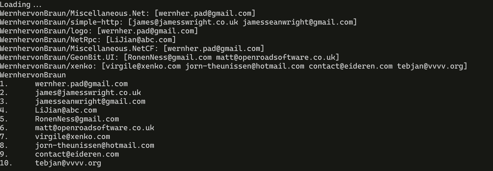

# github-sniffer

Sniff emails of github user

## Options

Enable debug with `-debug`, this will print every repository once scanned.

Authentication (for example with Fine-grained
personal access tokens, aquired from
[here](https://github.com/settings/personal-access-tokens)
). Pass `-auth=<YOUR TOKEN>`

